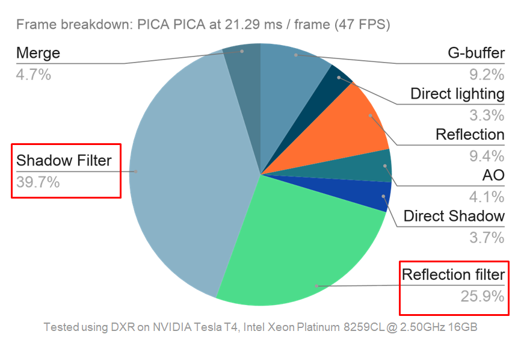

# DXR-Hybrid-Rendering

**University of Pennsylvania, CIS 565: GPU Programming and Architecture Final Project**

- Shenyue Chen  [Email](mailto:shenyuec@seas.upenn.edu)  [GitHub](https://github.com/EvsChen)  [LinkedIn](https://www.linkedin.com/in/shenyue-chen-5b2728119/)
- Szeyu Chan  [Email](mailto:sychan@seas.upenn.edu)  [GitHub](https://github.com/AsteriskChan)  [LinkedIn](https://www.linkedin.com/in/szeyuchan11/)
- Zijing Peng  [Email](mailto:zijingp@seas.upenn.edu)  [GitHub](https://github.com/ZijingPeng)  [LinkedIn](https://www.linkedin.com/in/zijing-peng/)

## Introduction

This project is to implement a hybrid rendering pipeline that combines both rasterization and raytracing to generate real-time effects. This hybrid rendering pipeline is built based on EA's [PICA PICA](https://www.ea.com/seed/news/seed-project-picapica) project. The pipeline includes multiple passes -- shadow, ambient occlusions, direct lighting and reflection. To denoise our results, we also implemented a SVGF filter. 

## Prerequisites

- Windows 10 version 1809 or newer
- Visual Studio 2019
- [Microsoft Windows SDK version 1903 (10.0.18362.1)](https://developer.microsoft.com/en-us/windows/downloads/sdk-archive)

## Features

### Shadow

Shadows are implemented by launching rays towards the light source. To create soft penumbra shadows, we cast rays by sampling in the shape of a cone.

| Hard Shadow              | Soft Shadow (1 spp) |
| ------------------------ | --------------------- |
|  |     |

To filter the shadows, we applied a SVGF-based filter. 

| Raytraced Shadow (1 spp) | Raytraced Shadow with Filter (1 spp) |
| ------------------------ | ------------------------------------ |
|      |             |

### Ambient Occlusion

We did not implement global illumination in this project, ambient occlusion is used to add realism to our renders. We also used the SVGF-based filter for denoising AO results.

| AO (1 spp)       | AO with filter (1 spp) |
| ---------------- | ---------------------- |
|  |   |

To improve the performance, we merge the shadow buffer and the AO buffer into one buffer and then add the filter.

### Reflection

To create a nice visual effect of reflection, we first sampled the normal distribution at the intersection of the specular surface. With this sampled normal, we could launch a reflected ray and collect the information when it first hit another object. We used the Halton sequence for sampling because it is well distributed for low and high sample counts.

Another SVGF-based filter is applied for denoising the result.

We also tried to improve the performance by launching a quarter ray per pixel. In our test scene, when the camera is static, the filtered results of 1 spp reflection and 1/4 spp reflection are similar. When the camera is moving fast, the filtered result of quarter resolution reflection is more noisy than the other. However, after applying the quarter resolution reflection, our improvement hugely improved. The performance is improved from 2.01 ms/frame to 0.72 ms/frame based on our profiling of Pica Pica scene (DXR on NVIDIA Tesla T4, Intel Xeon Platinum 8259CL @ 2.50GHz 16GB).

| Reflection (1/4 spp)      | Reflection with filter (1/4 spp)   |
| ------------------------- | ---------------------------------- |
|  |           |
| **Reflection (1 spp)**    | **Reflection with filter (1 spp)** |
|  |           |

## Performance Analysis
In this performance analysis section, we compare our hybrid rendering pipeline to a naively-implemented path tracer under different bounces.

First, we use the pica-pica scene and find out that the path tracer performs better in 1-3 bounces. We then use the living room scene. In this scene, our hybrid rendering pipeline out-performs the path tracer in all 1-3 bounces. In complex lighting scenarios, our hybrid renderer has a similar performance as the simple scene, while the path tracer's performance decreases significantly.

Above is a pie chart showing the breakdown of the time used by different passes. The two filters take up more than 50% percent of the total time, even though a lot of information is shared. 

## Results

## Credit

- [Hybrid Rendering for Real-Time Ray Tracing](https://link.springer.com/chapter/10.1007/978-1-4842-4427-2_25), Colin Barré-Brisebois, Henrik Halén, Graham Wihlidal, Andrew Lauritzen, Jasper Bekkers, Tomasz Stachowiak and Johan Andersson. *Ray Tracing Gems*.
- [GDC Talk: Shiny Pixels and Beyond: Real-Time Raytracing at SEED](https://www.gdcvault.com/play/1024801/-Real-time-Raytracing-for) 
- [Falcor](https://github.com/NVIDIAGameWorks/Falcor), a real-time rendering framework supporting DirectX 12. We used this framework to build our project.
- [Introduction To DirectX Raytracing](http://cwyman.org/code/dxrTutors/dxr_tutors.md.html), really helpful!
- Models we use for testing:
  - [Pica Pica Assets](https://github.com/SEED-EA/pica-pica-assets) by SEED, EA.
  - [Mirror's Edge Apartment - Interior Scene](https://sketchfab.com/3d-models/mirrors-edge-apartment-interior-scene-9804e9f2fe284070b081c96ceaf8af96) by Aurélien Martel.
  - [Anime Classroom](https://sketchfab.com/3d-models/anime-classroom-1375eb36d7b640bfad315e76053d63c6) by BigMiniGeek.

